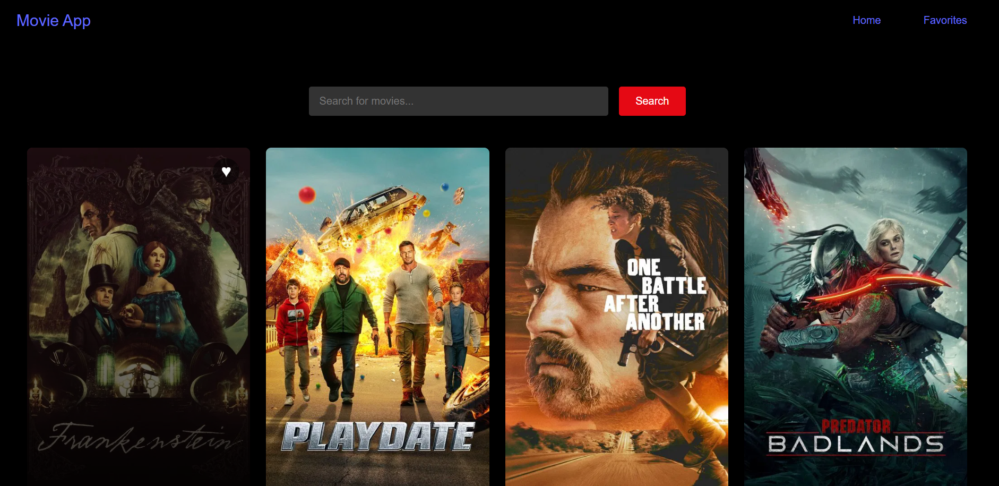
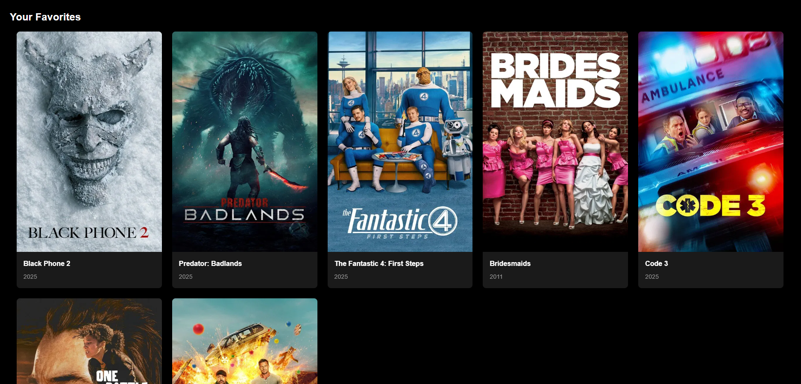
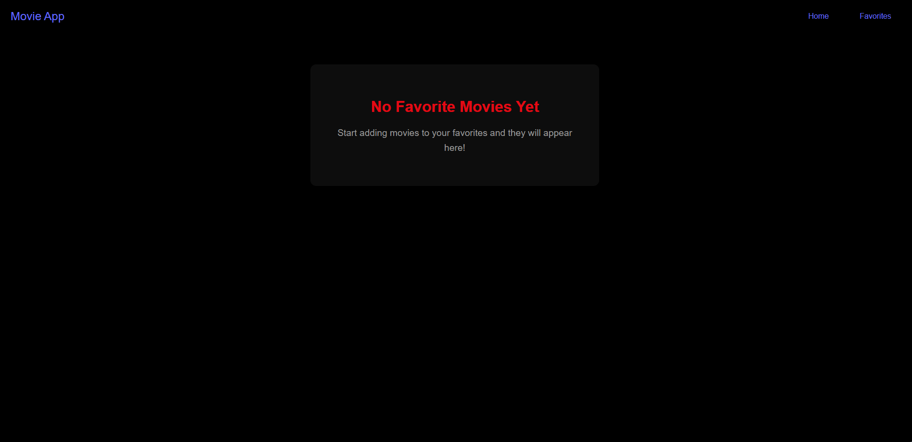

🎬 React Movie Platform

A React movie platform built with Vite where users can browse movies, search for titles, and save favorites — similar to Netflix.

🚀 Live Demo

 https://movie-app-ipq6.vercel.app

✨ Features

Browse popular movies

Search for any movie

Add/remove favorites

Favorites persist using localStorage

Responsive movie grid layout

📸 Screenshots

Make sure you placed the images inside:
frontend/screenshots/

frontend/
 └─ screenshots/
      ├─ homepage.png
      ├─ favorites.png
      └─ empty-favorites.png

Correct screenshot imports:

🧩 How to Use

Open the live demo.

Browse movies on the homepage.

Click the heart ♥ to add a movie to favorites.

Navigate to /favorites to view your list.

🛠️ Running Locally
# 1. Clone the repo
git clone https://github.com/rahmaelshamy/Movie-App.git

# 2. Go into the project folder
cd Movie-App/frontend

# 3. Install dependencies
npm install

# 4. Run the development server
npm run dev

Open the app at:

👉 https://movie-app-ipq6.vercel.app/

📦 Tech Stack

React
Vite
React Router
CSS